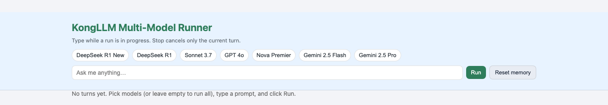
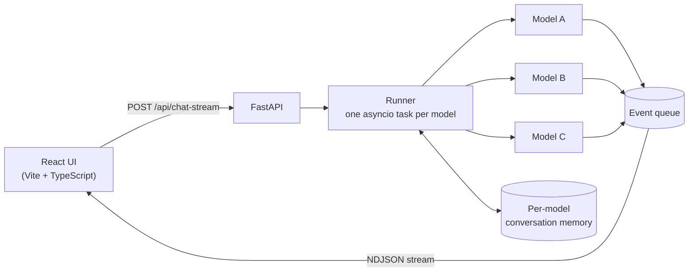
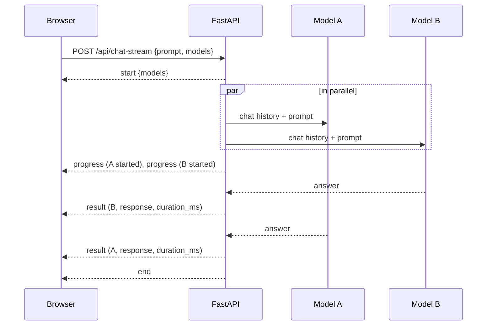

<div align="center">

# Multi-LLM Runner

**Ask once. Compare every model.**

Send one prompt to several large language models in parallel and watch their answers stream in side by side, each with its own conversation memory and response time.


[Features](#features) · [How it works](#how-it-works) · [Quick start](#quick-start) · [Configuration](#configuration) · [API](#api-reference) · [Roadmap](#roadmap)



</div>

---

## Why

Comparing language models usually means pasting the same prompt into several chat windows, losing track of which model said what, and guessing at speed. Multi-LLM Runner makes that comparison a single action: one prompt goes to every selected model at the same moment, and each answer arrives in its own column as soon as that model finishes. Follow-up prompts keep each model's own conversation history, so multi-turn behaviour can be compared too.

It was built as a lightweight workbench for evaluating models side by side, and as the foundation for a batch benchmark runner with an LLM judge (see the [roadmap](#roadmap)).

## Features

| Feature | What it does |
|---|---|
| ⚡ **Concurrent fan-out** | Every selected model is called in parallel with `asyncio`; a slow model never blocks a fast one. |
| 📡 **Live streaming** | Results stream to the browser as newline-delimited JSON the moment each model finishes. |
| 🧠 **Per-model memory** | Each model keeps its own multi-turn history; reset it for all models or a chosen subset. |
| ⏱️ **Latency and errors per model** | Every answer carries its response time; a failing model reports its own error without stopping the others. |
| 🔁 **Resilient calls** | Exponential-backoff retries on timeouts, rate limits and malformed responses; `<think>` reasoning blocks are stripped from answers. |
| 🔌 **Two providers** | Serve models through [OpenRouter](https://openrouter.ai) or a Kong-style LLM gateway, switched with one environment variable. |
| 📝 **Rich rendering** | GitHub-flavoured Markdown, syntax-highlighted code and KaTeX maths, sanitised before display. |

## How it works



Each prompt follows the same lifecycle:



## Quick start

**Requirements:** Python 3.11+, [uv](https://docs.astral.sh/uv/), Node.js 20+, and an [OpenRouter API key](https://openrouter.ai/keys).

```bash
git clone https://github.com/abubakaria56/Multi-LLM-Runner.git
cd Multi-LLM-Runner
```

<details open>
<summary><b>1. Start the backend</b></summary>

```bash
cd backend
cp .env.example .env          # set OPENROUTER_API_KEY
uv sync
uv run uvicorn app.main:app --reload --port 8000
```

Interactive API docs: http://localhost:8000/docs

</details>

<details open>
<summary><b>2. Start the frontend</b></summary>

```bash
cd frontend
npm install
npm run dev                   # http://localhost:5173
```

</details>

Open http://localhost:5173, select models (or none, to run them all), type a prompt and press **Run**.

## Configuration

Backend settings live in `backend/.env` ([example](backend/.env.example)).

| Variable | Purpose | Default |
|---|---|---|
| `LLM_PROVIDER` | `openrouter` or `kong` sends every model to that provider; `auto` routes per model | `kong` |
| `OPENROUTER_API_KEY` | OpenRouter API key | required for `openrouter` |
| `OPENROUTER_API_BASE_URL` | OpenRouter endpoint | `https://openrouter.ai/api/v1` |
| `KONG_API_KEY` · `API_GATEWAY_KEY` · `AUTH_TOKEN` | Kong gateway credentials | required for `kong` |
| `KONG_API_BASE_URL` | Kong gateway endpoint | required for `kong` |
| `ENABLED_MODELS` | Comma-separated default models when the client selects none | all models |

The frontend reads `VITE_API_BASE_URL` ([example](frontend/.env.example)) and defaults to `http://localhost:8000`.

<details>
<summary><b>Supported models</b></summary>

Models are defined in [`backend/app/models/llm_provider.py`](backend/app/models/llm_provider.py), one map per provider.

| Display name | OpenRouter ID |
|---|---|
| DeepSeek R1 New | `deepseek/deepseek-r1-0528` |
| DeepSeek R1 | `deepseek/deepseek-r1` |
| Sonnet 3.7 | `anthropic/claude-3.7-sonnet` *(retired on OpenRouter; swap in a current Claude ID)* |
| GPT 4o | `openai/gpt-4o-2024-08-06` |
| Nova Premier | `amazon/nova-premier-v1` |
| Gemini 2.5 Flash | `google/gemini-2.5-flash` |
| Gemini 2.5 Pro | `google/gemini-2.5-pro` |

To add a model, add its display name and provider ID to the maps, and to `ALL_MODELS` in [`frontend/src/App.tsx`](frontend/src/App.tsx).

</details>

## API reference

All routes are under `/api`.

### `POST /api/chat-stream`

```json
{ "prompt": "Explain attention in two sentences.", "models": ["GPT 4o", "Gemini 2.5 Pro"] }
```

`models` is optional. The response is `application/x-ndjson`, one event per line:

```json
{"event": "start", "count_prompts": 1, "models": ["GPT 4o", "Gemini 2.5 Pro"]}
{"event": "progress", "model": "GPT 4o", "prompt_index": 0, "prompt": "…", "status": "started"}
{"event": "result", "model": "GPT 4o", "prompt_index": 0, "prompt": "…", "response": "…", "error": null, "duration_ms": 2140}
{"event": "end"}
```

Every selected model produces exactly one `result`: `error` is `null` on success, and `response` is empty on failure.

### `POST /api/reset-memory`

`{ "models": ["GPT 4o"] }` clears those models' history; omit `models` to clear all.

### `POST /api/remove-models`

`{ "models": ["Nova Premier"] }` drops those models' history and marks them unused, so they start fresh if selected again.

## Project structure

```
Multi-LLM-Runner/
├── backend/
│   └── app/
│       ├── main.py                    FastAPI app and CORS
│       ├── api.py                     HTTP routes
│       ├── core/settings.py           environment settings
│       ├── models/llm_provider.py     OpenRouter and Kong clients, retries, routing
│       ├── models/question_objects.py benchmark loader and LLM-judge schema
│       └── services/
│           ├── runner.py              concurrent fan-out and event streaming
│           └── state.py               per-model conversation memory
└── frontend/
    └── src/App.tsx                    model picker, streaming columns, Markdown and maths
```

## Roadmap

- [x] Concurrent multi-model chat with per-model memory
- [x] Streaming results with per-model latency and errors
- [x] OpenRouter and Kong gateway providers
- [ ] **Batch benchmark mode:** run a JSONL benchmark across models (loader and schema already in `question_objects.py`)
- [ ] **LLM-judge grading:** score each answer YES/NO with reasoning, using the `JudgeResponse` schema
- [ ] Enforce `MAX_CONCURRENT_EVALS` and per-client conversation memory (memory is currently held in process and shared)
